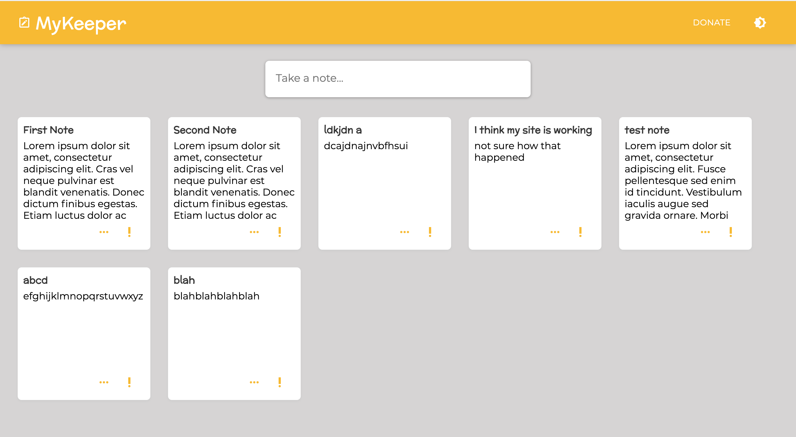

<div id="top"></div>

<!-- PROJECT LOGO -->
<br />
<div align="center">
  <a href="https://github.com/lcmedina/MyKeeper">
    
  </a>

<h3 align="center">myKeeper</h3>

  <p align="center">
    A Google Keep Wannabe.
    <br />
    <a href="https://github.com/github_username/repo_name"><strong>Explore the docs »</strong></a>
    <br />
    <br />
    <a href="https://react-my-keeper.herokuapp.com/">View Demo</a>
    ·
    <a href="https://github.com/lcmedina/MyKeeper/issues">Report Bug</a>
    ·
    <a href="https://github.com/lcmedina/MyKeeper/issues">Request Feature</a>
  </p>
</div>


<!-- TABLE OF CONTENTS -->
<details>
  <summary>Table of Contents</summary>
  <ol>
    <li>
      <a href="#about-the-project">About The Project</a>
      <ul>
        <li><a href="#built-with">Built With</a></li>
      </ul>
    </li>
    <li>
      <a href="#getting-started">Getting Started</a>
      <ul>
        <li><a href="#prerequisites">Prerequisites</a></li>
        <li><a href="#installation">Installation</a></li>
      </ul>
    </li>
    <li><a href="#roadmap">Roadmap</a></li>
    <li><a href="#contributing">Contributing</a></li>
    <li><a href="#contact">Contact</a></li>
    <li><a href="#acknowledgments">Acknowledgments</a></li>
  </ol>
</details>


<!-- ABOUT THE PROJECT -->
## About The Project

[](https://react-my-keeper.herokuapp.com/)

This is a note keeping application designed to help you manage and keep your ideas organized! Modeled afted Google Keep, I decided to keep the design and functionality as user-friendly as possible. The donation page is set up to function through a Paypal Sandbox environment.

<p align="right">(<a href="#top">back to top</a>)</p>


### Built With

* [Heroku](https://www.heroku.com/)
* [React.js](https://reactjs.org/)
* [Material UI](https://mui.com/)
* [react-paypal-js](https://www.npmjs.com/package/@paypal/react-paypal-js)
* [JSON-server](https://www.npmjs.com/package/json-server)

<p align="right">(<a href="#top">back to top</a>)</p>


<!-- GETTING STARTED -->
## Getting Started

Simply fork or clone this repo to get started on your own!

### Prerequisites

You will need the latest version of node for this project.

* npm
  ```sh
  npm install npm@latest -g
  ```

### Installation

1. Clone the repo
   ```sh
   git clone https://github.com/lcmedina/MyKeeper.git
   ```
2. Install NPM packages
   ```sh
   npm install
   ```
3. Spin up the JSON server
   ```sh
   npx json-server --watch data/db.json --port 8000
   ```
4. Start your React app
    ```sh
    npm start
    ```

<p align="right">(<a href="#top">back to top</a>)</p>


<!-- ROADMAP -->
## Roadmap

### Future Updates
* MongoDB - Currently all notes are stored in a JSON server.
* User Accounts - Allow private accounts to store everyone's own, unique ideas.
* Tag Notes - Add flags to notes for different priorities.

### Known Bugs
* Currently the 'important' flag is not functioning.
* Dark mode does not persist when the page is refreshed.

<p align="right">(<a href="#top">back to top</a>)</p>


<!-- CONTRIBUTING -->
## Contributing

Contributions are what make the open source community such an amazing place to learn, inspire, and create. Any contributions you make are **greatly appreciated**.

If you have a suggestion that would make this better, please fork the repo and create a pull request.
Don't forget to give the project a star! Thanks again!

1. Fork the Project
2. Create your Feature Branch (`git checkout -b feature/AmazingFeature`)
3. Commit your Changes (`git commit -m 'Add some AmazingFeature'`)
4. Push to the Branch (`git push origin feature/AmazingFeature`)
5. Open a Pull Request

<p align="right">(<a href="#top">back to top</a>)</p>


<!-- CONTACT -->
## Contact

[Laura Medina](https://www.laurachristine.net) - lcmedina390@gmail.com

Project Link: [https://github.com/lcmedina/MyKeeper](https://github.com/lcmedina/MyKeeper)

<p align="right">(<a href="#top">back to top</a>)</p>


<!-- ACKNOWLEDGMENTS -->
## Acknowledgments

* [Full Modern React Tutorial](https://www.youtube.com/playlist?list=PL4cUxeGkcC9gZD-Tvwfod2gaISzfRiP9d)
* [Material UI Docs](https://mui.com/getting-started/usage/)
* The Awesome Team at [DigitalCrafts](https://www.digitalcrafts.com/)

<p align="right">(<a href="#top">back to top</a>)</p>


<!-- MARKDOWN LINKS & IMAGES -->
<!-- https://www.markdownguide.org/basic-syntax/#reference-style-links -->
[contributors-shield]: https://img.shields.io/github/contributors/github_username/repo_name.svg?style=for-the-badge
[contributors-url]: https://github.com/github_username/repo_name/graphs/contributors
[forks-shield]: https://img.shields.io/github/forks/github_username/repo_name.svg?style=for-the-badge
[forks-url]: https://github.com/github_username/repo_name/network/members
[stars-shield]: https://img.shields.io/github/stars/github_username/repo_name.svg?style=for-the-badge
[stars-url]: https://github.com/github_username/repo_name/stargazers
[issues-shield]: https://img.shields.io/github/issues/github_username/repo_name.svg?style=for-the-badge
[issues-url]: https://github.com/github_username/repo_name/issues
[license-shield]: https://img.shields.io/github/license/github_username/repo_name.svg?style=for-the-badge
[license-url]: https://github.com/github_username/repo_name/blob/master/LICENSE.txt
[linkedin-shield]: https://img.shields.io/badge/-LinkedIn-black.svg?style=for-the-badge&logo=linkedin&colorB=555
[linkedin-url]: https://linkedin.com/in/linkedin_username
[product-screenshot]: images/screenshot.png
